# Мінотавр

#### Опис


Сьогодні ми продовжимо працювати в лабіринті й навчимося створювати систему фейєрверків і притискних панелей, а також битимемося з Мінотавром!👾


## Згадаймо🤔

1. Що таке нить Аріадни?&#x20;
2. Хто такий Мінотавр?&#x20;
3. Де з'явився перший фейєрверк?
4. Як створити фейєрверк?

## Сьогодні ми:

1. Побудуємо систему запуску фейєрверків
2. Створимо систему з притискних панелей, пилу редстоуну, липкого поршню та блок смарагду
3. Навчимося виводити на екран різні символи та текст при натисканні натискної панелі (з висування)

### Події

На початку заняття відпрацюємо створення елементів, які можуть сигналізувати про прохід агенту чи гравця в певній точці.

### Фейєрверки

Побудуйте систему запуску фейєрверків з **дубовими притискними пластинами**, **пилом редстоуну** та **розподілювачами**.

|            |                             |
| ---------- | --------------------------- |
| Код:       | 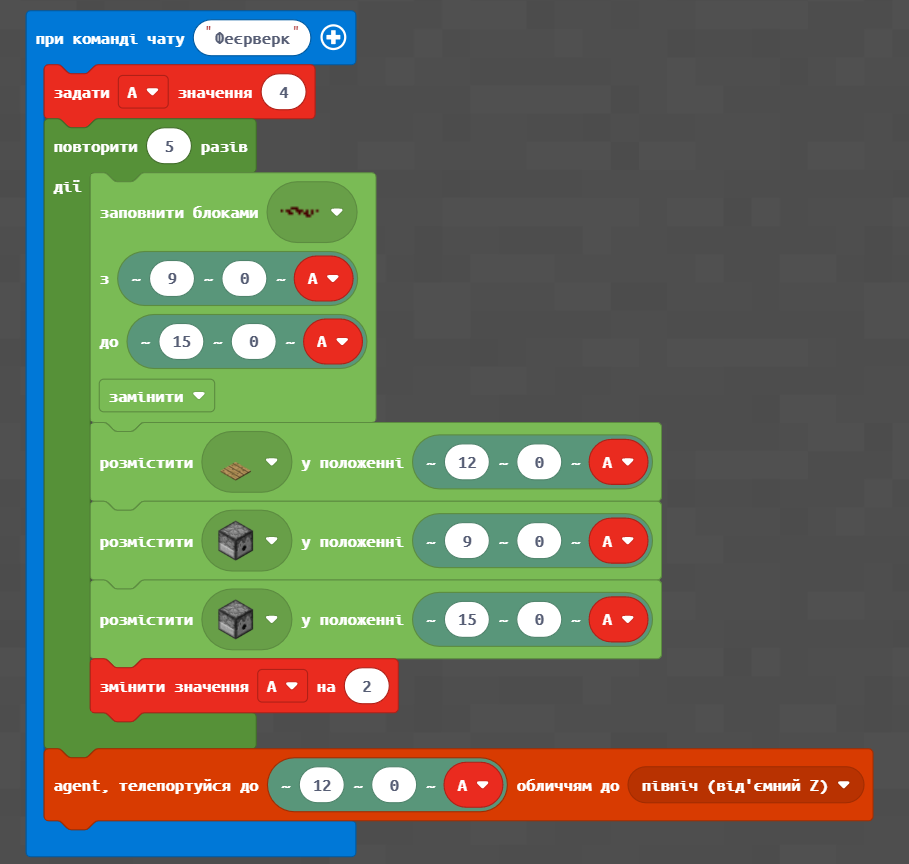 |
| Результат: |  |

До розподілювачів завантажимо фейєрверки.

.png>).png>)

Сформуємо код, який запрограмує Агента так, щоб він почав бігати і натискати пластини.

|            |                                                                   |
| ---------- | ----------------------------------------------------------------- |
| Код:       | 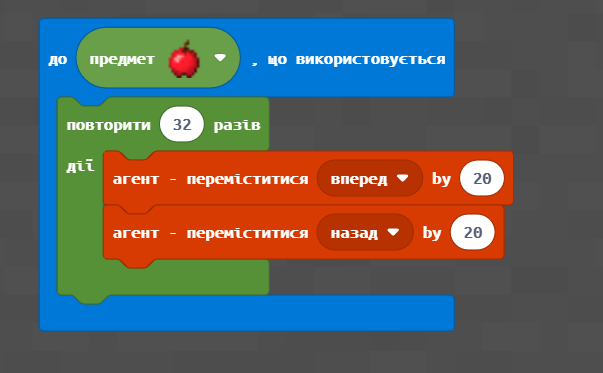                                       |
| Результат: | .gif>) |


При виконанні коду - треба дочекатися, щоб Агент всі кроки “вибігав” - тоді він знову опиниться в потрібній точці.


#### [Липкий поршень](https://makecode.com/\_gtCLmE2Lx9f3)

Створіть систему з притискних панелей, пилу редстоуну, липкого поршню та блок смарагду.

|            |                                                                                                                           |
| ---------- | ------------------------------------------------------------------------------------------------------------------------- |
| Код:       | 
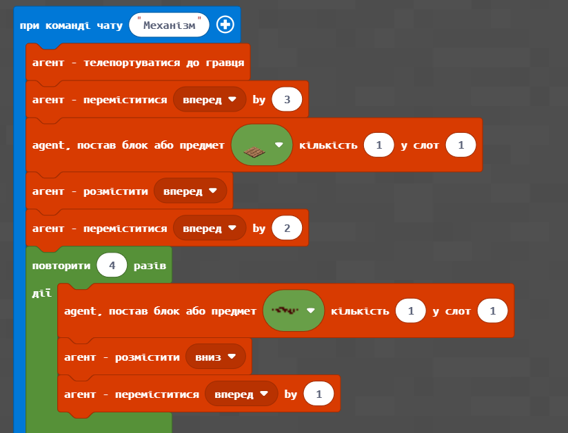 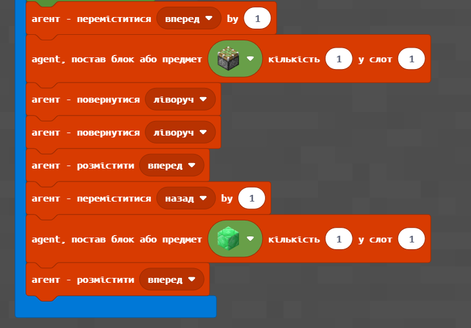
                             |
| Результат: |  |

Перевірте роботу створеної системи.

Визначте координати поруч із блоком смарагду **(0;-60;-12)**.&#x20;

<figure>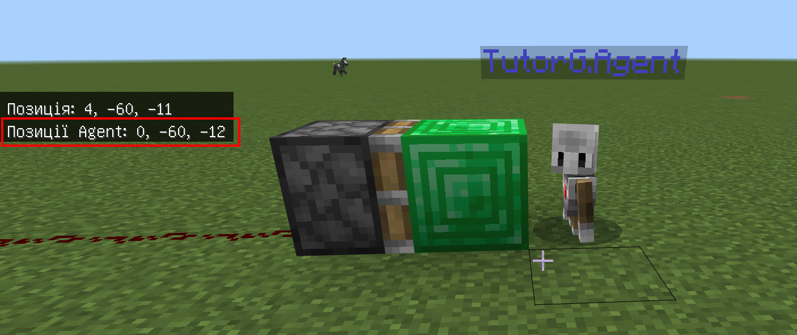<figcaption></figcaption></figure>


**Зверніть увагу!** У вас координати (**0;-60;-12**) будуть іншими, їх значення необхідно брати із вказівника координат в точці, куде липкий поршень пересуває блок смарагду **у вашому світі.**


Сформуйте код, який контролює наявність блоку смарагду у визначених координатах (**0;-60;-12**).\

<figure>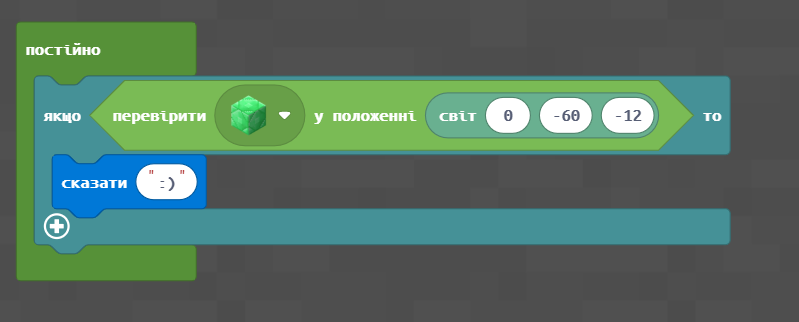<figcaption></figcaption></figure>

Перевірте роботу відповідного елементу.

<figure><figcaption></figcaption></figure>

### Події

|               |                                                                                                                                                                                                                                                                                          |
| ------------- | ---------------------------------------------------------------------------------------------------------------------------------------------------------------------------------------------------------------------------------------------------------------------------------------- |
| **Завдання**  | 

<ol><li>Виведіть на екран символи «<strong>:-)</strong>» при натисканні натискної панелі (із висування).</li><li>Виведіть на екран символи «<strong>!</strong>» при натисканні натискної панелі.</li><li>Виведіть поточний ігровий час при натисканні натискної панелі.</li></ol> |
| **Код**       | 

                                                                                                                                               |
| **Результат** | 

                                                                                                                                                                         |

### Одна дія

Ви можете побачити в попередньому завданні, що виведення на екран тексту повторюється декілька разів. Для того, щоб дія повторювалася лише один раз, необхідно використовувати змінну, якій значення задаємо при команді «start». Встановимо код, який задає змінній flag **значення 0** та виведемо на екран повідомлення «**(+) Flag activated.**»

Додамо умову спрацьовування (знаходження блоку смарагду в точці (-30;4;-99)) та за умови, що змінна flag має значення 0

<figure>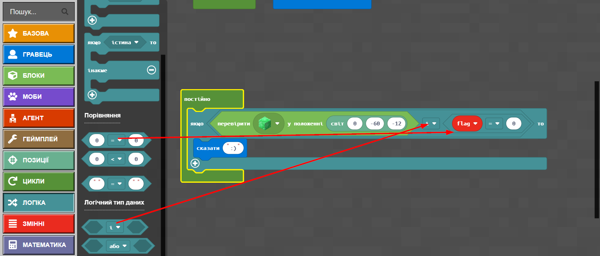<figcaption></figcaption></figure>

Змінимо значення змінної **flag на 1**. В результі дія, що зазначена в цій умові (в нашому випадку це вивід на екран символів «**:-)**») відбудеться лише 1 раз.

<figure>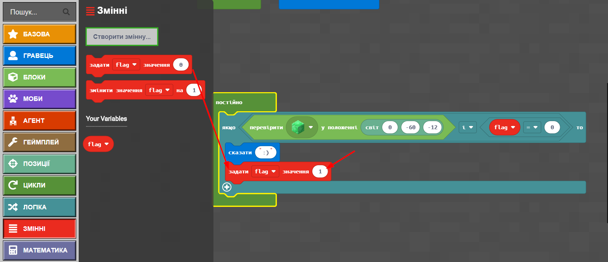<figcaption></figcaption></figure>

Змінимо текст повідомлення на «**(-) Flag deactivated.**»

<figure>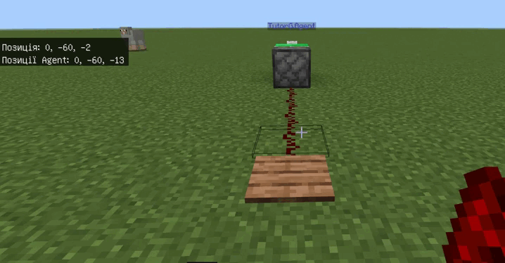<figcaption></figcaption></figure>

Для створеної системи з притискної панелі, пилу редстоуну, липкого поршню та блоку смарагду запрограмуйте наступні дії (_**зверніть увагу**, що в вашому випадку координати можуть відрізнятися, і вам необхідно визначати координати місця, у яке переміщується блок смарагду самостійно_):

| **Завдання**  | <ol><li>Запрограмуйте так, щоб при команді <strong>start</strong> на екран було виведено текст <strong>(+)Flag activated</strong>, а при натисканні панелі — один раз було виведено <strong>(-)Flag deactivated</strong></li><li>Запрограмуйте так, щоб при команді <strong>start</strong> на екран було виведено текст <strong>Action started!</strong>, а при натисканні панелі — один раз було виведено <strong>Action stoped!</strong></li></ol> |
| ------------- | ---------------------------------------------------------------------------------------------------------------------------------------------------------------------------------------------------------------------------------------------------------------------------------------------------------------------------------------------------------------------------------------------------------------------------------------------------- |
| **Код**       | 
 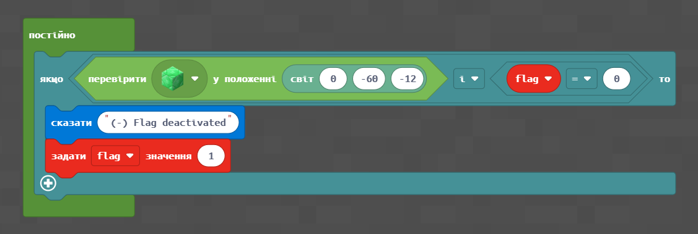
                                                                                                                                                                                                                                                                                                                                                        |
| **Результат** |                                                                                                                                                                                                                                                                                                                                                                                |

## Творче завдання:

1. Задайте самостійно за власним бажанням текст, що буде виводитися на екран при команді чату start та при натисканні натискної панелі.

## Фіксація розбиття блоків

За команди чату **start2** задамо змінній **flag2** значення **1** та виведемо на екран повідомлення «**start**». А також перенесемо гравця в точку **(-40;-60;-90)** та розмістимо блок алмазу в точці **(-45;-60;-90)**\
****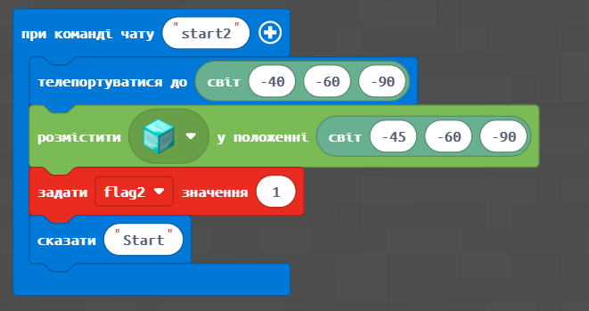****

Задамо код, який виводить повідомлення «**finish**», якщо блок алмазу знищити. Задамо код, який виводить повідомлення «**finish**», якщо блок алмазу знищити.

<figure><figcaption></figcaption></figure>

Подивимось на на результат

<figure><figcaption></figcaption></figure>

## Фіксація розбиття 2-х блоків

Створимо два блоку: смарагду та алмазу та задамо змінним **flag3** та **flag4** значення 1, а також виведемо на екран текст «**Initialisation**»

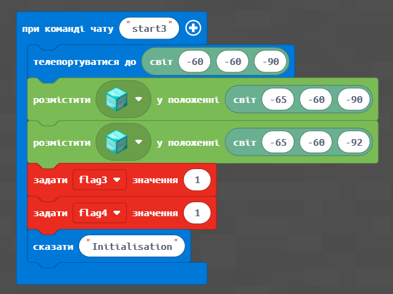

При знищенні алмазного блоку напишемо на екрані **Start,** при знищенні смарагдового — напишемо на екрані **Finish**

<figure>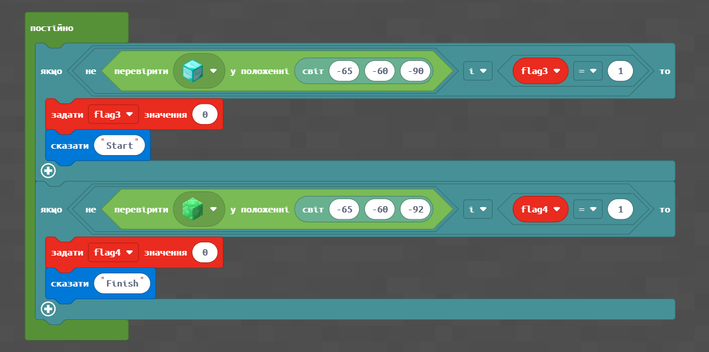<figcaption></figcaption></figure>

Подивимось на результат

.gif>)

## Лабіринт **** Мінотавра

Поновимо лабіринт з попереднього заняття.

|     **1**     | .png>)  |
| :-----------: | ------------------------------------- |
|     **2**     | .png>) |
|     **3**     | .png>)  |
|     **4**     | .png>)  |
| **Результат** | .png>) |
|               |                                       |


Як ви пам'ятаєте, **Мінотавр** — міфічна страшна істота з тулубом людини і головою бика — був народжений Пасіфаєю, дружиною царя Міноса (одного з трьох синів Зевса і Європи) від бика, якого володар морів Посейдон відправив на острів Крит. Цар Мінос замкнув Мінотавра в лабіринті, складній споруді, яку побудував спеціально для цього Дедал.

Андрогеос, син Міноса, взяв участь в іграх в Афінах і **став переможцем у всіх спортивних дисциплінах**. Хтось зі скривджених афінян влаштував засідку і **вбив його**. Це вбивство викликало гнів Міноса, він негайно ж оголосив війну Афінам і розпочав воєнний похід. Відшкодування збитку, яке він зажадав у афінського царя Егея, було набагато жорсткіше й ганебніше, ніж сама поразка Афін: _**кожні 9 років Егей повинен був відправляти в лабіринт 7 дівчат і 7 юнаків**_. Їх зачиняли у величезному палаці-лабіринті, де їх пожирало чудовисько.

.png>)


Створимо в нашому лабіринті Мінотавра і спробуємо з ним битися!

.png>)

.png>)

## Супер-творче завдання

Додайте до лабіринту власні елементи за бажанням:&#x20;

* притискні панелі з феєрверками;
* липкі поршні, що дозволяють фіксувати наявності блоків в точці з певними координатами;
* а також появою негативних мобів за умови доходження до кінці лабіринту.

