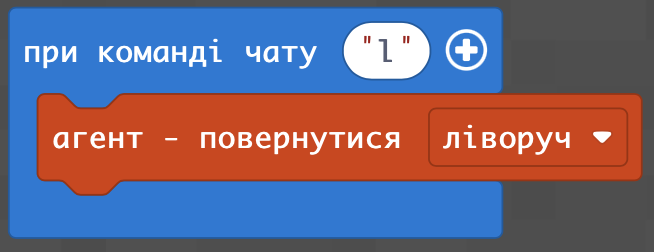

# ⭐️Домашнє завдання⭐️

**Основні завдання:**

1. Додайте в лабіринт механізми
2. Створіть негативних мобів на певних координатах (мінімум 3).\

**🌟Додаткове (не обовʼязково виконувати):**

1. Сховайте залізну кирку (або краще інструмент) в скриню (її можна поставити в будь-яку частину лабіринту до алмазного блоку), на певних координатах поставьте алмазний блок. Це буде додаткова перешкода для гравця, яку він зможе пройти, розбивши блок.

<figure><figcaption></figcaption></figure>
